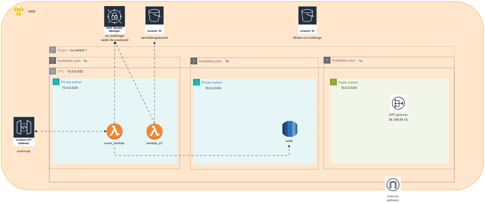

# 🛠️ Infrastructure for VW Challenge

This project uses **Terraform** to provision AWS infrastructure for the VW Challenge application

---

## 🏛️ Architecture Diagram




## 📁 Project Structure

```
├── main/ # Main TF entrypoint
├── networking/ # VPC, subnets, route tables
├── rds/ # PostgreSQL DB setup (RDS)
├── lambda_to_rds/ # Lambda to insert event in RDS
├── lambda_to_s3/ # Lambda to count events and store in S3
├── api_gateway/ # API Gateway for lambda 'lambda_to_rds'
├── s3/ # S3 bucket for storing event count from lambda 'lambda_to_s3'
├── .github/workflows/ # GitHub Actions for CI/CD
└── README.md
```
---


## 🚀 Deploying Infrastructure (Locally)

- [Terraform](https://developer.hashicorp.com/terraform/downloads) >= 1.3.0
- [aws-cli](https://docs.aws.amazon.com/cli/latest/userguide/getting-started-install.html)
- Create user with IAM credentials and access to: Lambda, RDS, S3, API Gateway, VPC, Secrets Manager
- Run ```aws configure``` and you'll be prompted for aws_access_key_id and your aws_secret_access_key

---

## 🤖 Deploying Infrastructure via GH Actions

Steps:

1- Create the following **GitHub secrets** in repo Settings -> Secrets and Variables -> Actions:

| Secret Name              | Purpose                     |
|--------------------------|-----------------------------|
| `AWS_ACCESS_KEY_ID`      | AWS access key              |
| `AWS_SECRET_ACCESS_KEY`  | AWS secret key              |


2- Go to GitHub -> Actions -> Terraform Apply-> Run Workflow

The workflow will:
- Install Terraform CLI (v1.12.2)
- Configure AWS Credentials
- Run terraform init, plan and apply

---

## 🔌 How to test API

Once the infrastructure is deployed and the API Gateway is created, you can send events to the endpoint

🔐 Authentication

The API is protected using an API Key, which is stored securely in AWS Secrets Manager
To retrieve it go to AWS Console -> Secrets Manager -> vw-challenge/vwdb-rds-password -> Retrieve key value

Example Request:

Use curl to send a POST request with the required headers and payload:

```bash
curl -X POST https://<api-gateway-id>.execute-api.eu-central-1.amazonaws.com/data \
  -H "Content-Type: application/json" \
  -H "x-api-key: YOUR_API_KEY" \
  -d '{
        "event_type": "login",
        "timestamp": "2025-08-16T16:00:00Z"
      }'
```

Note:
Replace <api-gateway-id> with ID available in UI menu: API Gateway -> APIs

